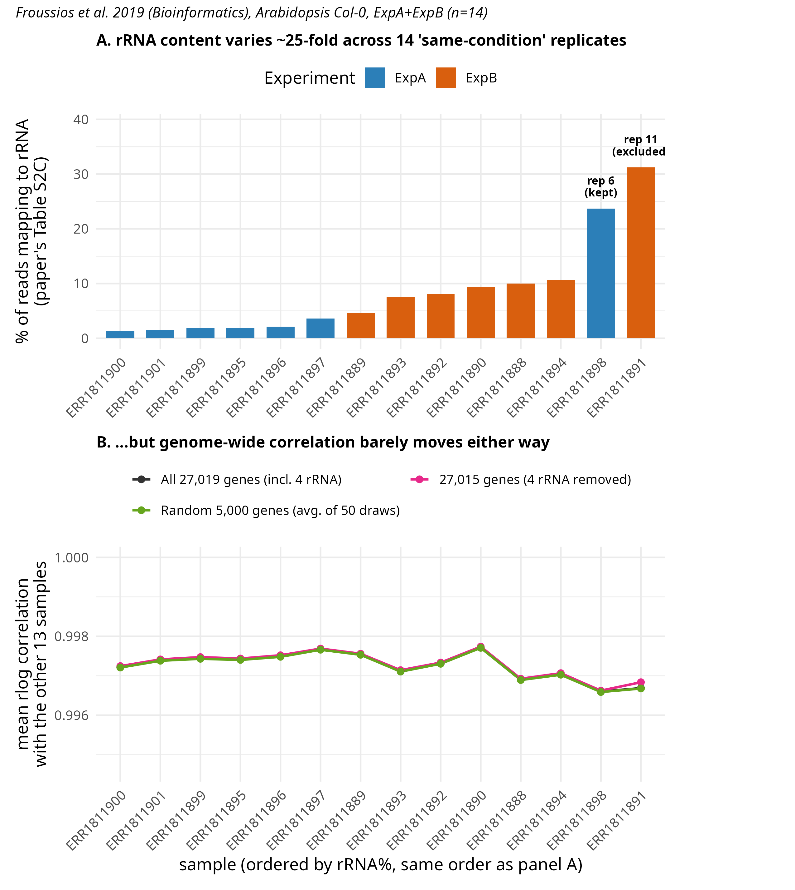

# Post 2: rRNA fraction vs. genome-wide correlation

**Question.** The 14 ExpA/ExpB replicates are the same genotype and condition, yet the paper's own
Table S2C reports rRNA fractions from 1.26% to 31.21%. Does a genome-wide sample-to-sample
correlation, the usual first QC check, reveal that difference?

**Short answer.** No. Every sample has a mean rlog correlation of about 0.997 with the other 13,
including replicate 6 (23.7% rRNA) and replicate 11 (31.21% rRNA, excluded from the original
analysis). The rRNA fraction varies about 25-fold; the correlation moves in the fourth decimal.

## What the analysis does
Run from the repository root, in this order (after `scripts/sra_download/` and `scripts/reference/`):

1. `trim_star_featurecounts.sh` — Trimmomatic, STAR, then `featureCounts -t gene` gene counts
   (`work/STAR_both/fC/`). Needs `ADAPTERS=/path/to/TruSeq3-PE.fa`. Posts 4 and 5 use these counts too.
2. `count_rRNA.sh` — realigns the raw reads with the paper's STAR settings and counts reads on the
   4 annotated rRNA loci (typed `ncRNA_gene`, so step 1 does not count them) into `work/rRNA_qc/counts/`.
3. `rRNA_correlation_blindspot.R` — makes the figure.

**Panel A.** rRNA % per sample, as published in the paper's Table S2C (`data/paper_TableS2C_rRNA.csv`),
ordered from lowest to highest.

**Panel B.** rlog (DESeq2, `blind = TRUE`) of the gene counts plus the 4 rRNA rows from step 2; for
each sample, the mean Pearson correlation with the other 13 samples, computed on three gene sets:
all genes, all genes without the 4 rRNA rows, and 5,000 random genes (mean of 50 draws).

## What this means for QC
- A high genome-wide correlation does not show that replicates have the same library composition.
  Post 3 explains why with a simulation: a handful of dominant features barely move a correlation
  computed over thousands of genes.
- The rRNA fraction per sample has to be measured and reported directly.

## Limits
- **Panel B's "incl. 4 rRNA" line does not contain the paper's rRNA signal.** The rRNA rows come
  from our recount in step 2 (current Ensembl Plants 63 annotation with only 4 rRNA loci,
  `--outFilterMultimapNmax 2`, featureCounts without `-M`). It undercounts severely — replicate 11
  gets about 0.006% instead of the published 31.21% — because rDNA is highly repetitive and mostly
  collapsed in the reference, and multimapping reads are discarded. The "incl." and "removed" lines
  therefore differ by almost nothing, and that comparison does not test what removing 31% rRNA would
  do. The point of the figure rests on panel A (published fractions) against the overall correlation
  level. Posts 4 and 5 model the published rRNA fraction instead of using this recount.
- Correlation is computed on rlog values, where a constant per-sample shift does not change r.
- 14 samples, one dataset.
