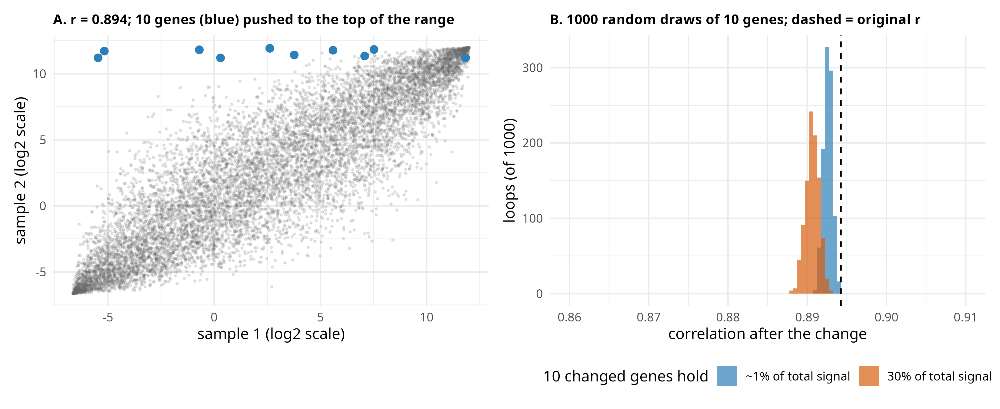

# Post 3: a handful of extreme genes barely moves a correlation

**Question.** A library in which a few genes (like rRNA) take a large share of all reads has a different *composition*.
Can a genome-wide correlation between samples detect that?

**Short answer.** No. Correlation is dominated by the thousands of genes that behave alike. Changing a handful of
values in a vector of 10,000 hardly changes it, even when those few values carry a large part of the total signal.

## What the simulation does (`simulation.R`)
1. Two vectors of 10,000 values on the log2 scale, ranging from log2(0.01) to 12 (typical rlog / log2 range), with correlation r = 0.894 (target 0.9).
2. In sample 2, 10 randomly chosen genes are changed a lot. This is repeated in 1,000 loops with new random genes.
3. After each loop, r between the two vectors is recomputed. Two scenarios:

| Scenario | The 10 changed genes | Share of the linear-scale total | r over 1,000 loops (baseline 0.894) |
|---|---|---|---|
| 1 | set to 11–12 (top of the range) | about 1% | 0.891 – 0.894 |
| 2 | set so that they hold 30% of the total (like the 31% rRNA library) | 30% | 0.888 – 0.893 |

Scenario 2 mimics the library with 31% rRNA in the paper: on the log2 scale those genes sit near 17, above the range of the other genes.

## Why it barely moves
- Ten genes are 0.1% of 10,000 points. Pearson correlation averages over all points, so 99.9% of them decide the result.
- A compositional change acts on the *share* of reads, which is a linear-scale quantity. Ten genes can carry 30% of it. On the log2 scale, where correlation is computed, they are still only ten points.
- The other 9,990 genes are scaled down by the same factor when the library is normalised. On the log2 scale that is a constant shift, and correlation ignores constant shifts.

## What this means for QC
- A high genome-wide correlation does **not** show that libraries have the same composition.
- A compositional problem that depends on a handful of loci (rRNA, a few highly expressed genes) is nearly invisible to correlation, sample clustering and PCA of the whole matrix.
- Detecting it needs a direct measure: the fraction of reads on those loci (for example, the rRNA fraction) per sample.

## Limits
- A simulation, not a proof for every dataset. It shows the size of the effect for 10 changed genes out of 10,000; changing hundreds of genes, or one gene at very high leverage in a small matrix, can move r much more.
- Real replicates correlate at about 0.997 (post 2), not 0.9. The 0.9 was chosen to leave room to see any movement.
- Values are drawn uniformly on the log2 scale. Real expression is more skewed, with most genes at low values.
- Scenario 2 changes only the 10 genes. Rescaling the others to keep the library size fixed would add a constant on the log2 scale, which does not change r.
