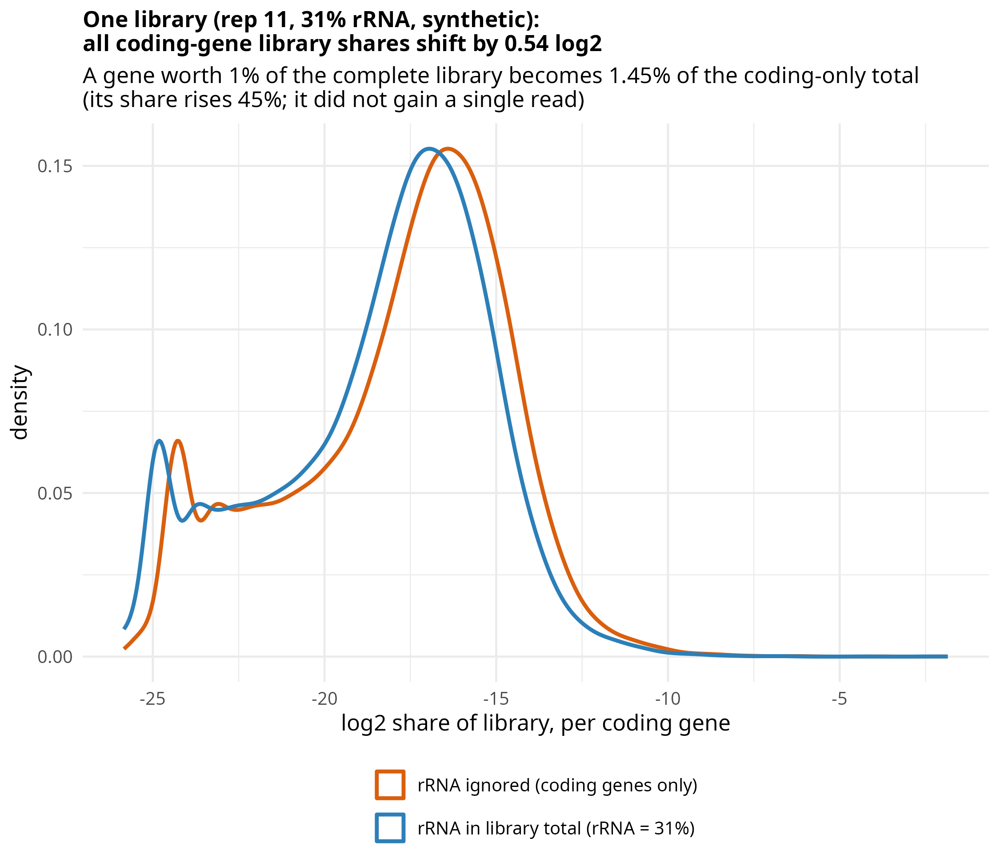

# Post 4: sensitivity analysis using the paper's published rRNA fractions

**Question.** `featureCounts -t gene` does not produce rows for the rRNA loci (they are typed
`ncRNA_gene`, see the repo's "Known limits"). If a dominant feature like rRNA is simply left out
of the count matrix — not filtered afterwards, just never counted — how does that affect
normalisation and DE calls?

**Short answer.** This is a sensitivity analysis using the paper's published rRNA fractions, not a
reconstruction of the real rRNA count matrix — our own current-annotation recount is known to
badly undercount rRNA (see the wider investigation's notes), so it isn't usable as a real
per-sample count here.

- **Panel A.** Under a simplified two-component model — counted coding genes plus rRNA — the
  published 31.21% rRNA fraction (replicate 11) corresponds to a 0.54 log2 rescaling of
  coding-gene shares when rRNA is omitted from the denominator.
- **Panel B.** Using the real coding-gene counts, one synthetic aggregate rRNA feature is added,
  calibrated to each sample's published Table S2C percentage. This tests how normalisation
  responds to the presence or absence of a dominant feature; it does not reconstruct the original
  rRNA count matrix. DESeq2's median-of-ratios normalisation is nearly invariant to this specific
  synthetic perturbation. Total-count scaling is sensitive, with DE calls changing in either
  direction. Large DE counts that persist under both versions reflect structure already present in
  the real coding-gene data — **the analysis does not establish that uncounted rRNA caused those
  false DE calls.**

## What the analysis does (`rRNA_ignored.R`)
Run from the repository root; uses the 14 ExpA/ExpB coding-gene counts (`work/STAR_both/fC/`).

**The synthetic rRNA feature.** `rrna <- colSums(coding) * p/(1-p)`, where `p` is the paper's
published rRNA fraction (Table S2C) for that sample. Solving the two-component model
`R = C·p/(1-p)` gives `R/(C+R) = p` by construction — this is not a recovered rRNA read count, it
is the amount of rRNA that would have to exist, under that simplified model, for the counted
coding total to represent fraction `p` of coding+rRNA. It also treats `colSums(coding)` as the
entire non-rRNA library, which ignores unassigned, multimapping, intergenic and other-noncoding
reads — a simplifying assumption, not a full reconstruction of library composition.

**Panel A.** log2 share of the library per coding gene, replicate 11 only, computed two ways: with
the synthetic rRNA feature in the total, and with rRNA ignored (coding genes only). Raw coding-gene
counts never change — only their computed share of the total does, by a constant `log2(1/(1-p))`.
That constant is sample-specific: it scales with each library's own published rRNA fraction, not a
fixed number across the dataset.

**Panel B.** Same batch (ExpA), same genotype — there is no *designed* group difference between the
two labels, so a `padj < 0.05` call is false relative to the randomized labels (this does not mean
the replicates have no real biological or technical heterogeneity among themselves — replicate 6,
23.7% rRNA, is included in every split below, by construction). 8 sampled 3-vs-3 splits are drawn
from the 7 ExpA replicates: replicate 6 plus 2 others in group 2, 3 of the remaining 4 in group 1
(1 of the 7 unused per split; `set.seed(1)` makes the selection reproducible).

Each split is run 4 ways, crossing the synthetic-rRNA-feature-present-in-the-size-factors vs.
ignored with DESeq2's own median-of-ratios vs. simple total-count scaling — but DE is always tested
on the *same* coding-only matrix; only the size factors differ between the two. This isolates the
normalisation effect from DESeq2's dispersion-trend fitting or independent filtering, which could
otherwise differ between the with-rRNA and coding-only gene sets. Panel B's `dB` table is also
written to `rRNA_ignored_panelB_results.csv`.

## Interpretation
- DESeq2 median-of-ratios is nearly invariant to this specific synthetic perturbation — the added
  feature is one row among thousands, and the median ratio barely moves.
- Total-count scaling is sensitive, with DE calls changing in either direction depending on the
  split — because its size factor is the column sum itself, which the synthetic feature directly
  perturbs.
- Large DE counts that persist whether the synthetic feature is present or not reflect structure
  already present in the real coding-gene data (e.g. a split's own replicate composition), not
  something the synthetic rRNA feature introduced.
- **This analysis does not establish that uncounted rRNA caused any specific false DE call** — it
  shows how the two normalisation strategies respond differently to a dominant feature being
  present or absent, under a synthetic, calibrated-to-published-percentages model.

## What this means for QC
- "The GTF/annotation doesn't have rRNA gene models" is not a reason to skip counting rRNA reads
  separately — a dominant, uncounted feature is a real (if here synthetically modelled)
  sample-specific compositional rescaling of every other gene's apparent expression, and
  normalisation strategies do not all respond to it the same way.
- DESeq2's default normalisation is more robust to this specific kind of perturbation than
  total-count scaling — but that robustness does not immunize a design against a genuinely
  contaminated replicate (see the persistently high-count splits in both facets of panel B).
- The rRNA fraction per sample (post 2's direct measurement) is still the check that would catch a
  real dominant-feature problem; a good genome-wide correlation or a reasonable-looking DESeq2 run
  will not flag it.

## Limits
- **This is a synthetic sensitivity analysis, not a reconstruction of the real rRNA count
  matrix.** The rRNA feature is back-calculated from the paper's published percentage and the
  counted coding total under a simplified two-component model, not recovered from the reads. An
  empirical version would need real per-locus rRNA counts in the same units as the coding matrix,
  and the paper's own Table S2C denominator (reads vs. read pairs vs. aligned vs. input) confirmed
  against how featureCounts was run here — neither is currently available (our own
  current-annotation recount undercounts badly enough to invert the sample ranking, see the wider
  investigation's notes).
- `colSums(coding)` is treated as the entire non-rRNA library, which excludes unassigned reads,
  multimappers, intergenic reads and other noncoding biotypes not counted by `-t gene` — a
  simplifying assumption, not a complete accounting of the library.
- Panel A's 0.54 log2 shift is specific to one library (31% rRNA); it scales with each library's
  own published rRNA fraction, not a fixed constant across samples.
- Panel B draws 8 of the 15 possible 3-vs-3-from-7 splits, not an exhaustive enumeration — a
  teaching-scale illustration, not a full power analysis. Replicate 6 is in every split by
  construction, so panel B specifically probes "what happens when a known high-rRNA replicate is
  in the design", not a randomly representative sample of ExpA as a whole.
- As stated above: persistently large DE counts under both treatments show structure already in
  the real coding-gene data. This analysis is not designed to, and does not, attribute those calls
  to uncounted rRNA specifically.
