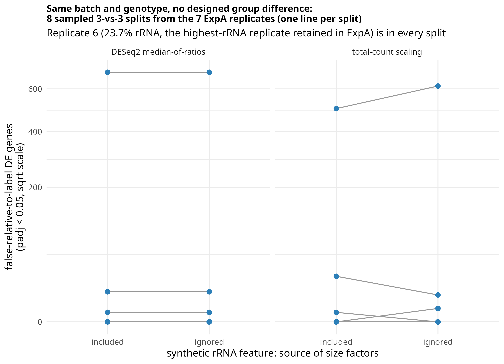

# Post 5: can normalization choice change false-DE counts?

**Question.** Post 4 showed that total-count normalization is directly sensitive to an omitted
dominant feature (rRNA), while DESeq2's median-of-ratios should be much less sensitive, since it
asks what happens to the typical gene rather than to the column sum. Does that difference in
sensitivity actually change which genes come out significant?

**Why replicate 6, not replicate 11.** Replicate 11 (post 4's 31% rRNA example) was excluded from
the original study's own analysis. To test consequences among *retained* samples from one
experiment, this post uses replicate 6 instead — the highest-rRNA replicate that was actually kept
in ExpA (23.7% reported rRNA per Table S2C). It is deliberately placed in group 2 in every
comparison below.

**Short answer.** Using the real coding-gene counts, one synthetic aggregate rRNA feature is added
(post 4's two-component model), calibrated to each sample's published Table S2C percentage. This
tests how normalisation responds to the presence or absence of a dominant feature; it does not
reconstruct the original rRNA count matrix.

- **DESeq2 median-of-ratios gave identical DE counts in all 8 comparisons**, whether the synthetic
  rRNA feature was included for size factors or not (e.g. one comparison: 689 = 689).
- **Total-count scaling changed in 4 of the 8 comparisons, in both directions** (two increased,
  two decreased when the feature was ignored).
- **One comparison stayed extreme under every treatment** (689 genes under median-of-ratios,
  503-615 under total-count scaling) — this reflects structure already present in the real
  coding-gene data, not something the synthetic rRNA feature introduces (see "Split 6" below and
  post 6).

## What the analysis does (`false_DE_by_normalization.R`)
Run from the repository root; uses the 14 ExpA/ExpB coding-gene counts (`work/STAR_both/fC/`).

Same batch (ExpA), same genotype — there is no *designed* group difference between the two labels,
so a `padj < 0.05` call is false relative to the randomized labels (this does not mean the
replicates have no real biological or technical heterogeneity among themselves — replicate 6 is
included in every split by construction). 8 sampled 3-vs-3 splits are drawn from the 7 ExpA
replicates: replicate 6 plus 2 others in group 2, 3 of the remaining 4 in group 1 (1 of the 7
unused per split; `set.seed(1)` makes the selection reproducible).

The code samples eight of the 15 possible choices for replicate 6's two group-2 partners, then
randomly selects three of the remaining four samples for group 1. This is not an exhaustive
enumeration of the 60 possible comparisons (`choose(6,2) * choose(4,3) = 15 * 4 = 60`).

Each split is run 4 ways, crossing the synthetic rRNA feature included for size factors vs.
ignored for size factors with DESeq2's own median-of-ratios vs. simple total-count scaling — but
DE is always tested on the *same* coding-only matrix; the rRNA feature is never part of the tested
DE matrix, only of size-factor estimation. This isolates the normalisation effect from DESeq2's
dispersion-trend fitting or independent filtering, which could otherwise differ between the
with-rRNA and coding-only gene sets. The underlying table is written to
`false_DE_by_normalization_results.csv`.

## Interpretation
- DESeq2 median-of-ratios is invariant to this specific synthetic perturbation in every one of the
  8 comparisons run here — the added feature is one row among thousands, and the median ratio
  does not move enough to flip any call.
- Total-count scaling is sensitive, changing in 4 of 8 comparisons, in both directions — because
  its size factor is the column sum itself, which the synthetic feature directly perturbs.
- The comparison with the largest DE count (689 median-of-ratios / 503-615 total-count) stays
  large under every treatment tested — this reflects structure already present in the real
  coding-gene data (the specific 3-vs-3 composition of that split), not something the synthetic
  rRNA feature introduces.
- **This analysis does not establish that uncounted rRNA caused any specific false DE call** — it
  shows how two normalisation strategies respond differently to a dominant feature being present
  or absent, under a synthetic, calibrated-to-published-percentages model.

## Split 6: a different phenomenon
Split 6 (replicates 1, 2, 3 vs. 4, 5, 6; replicate 7 unused) gives more than 500 DE genes under
every treatment. Its group 2 holds the three highest-rRNA ExpA replicates (2.10%, 3.60%, 23.70%),
group 1 three of the four lowest (1.26%, 1.58%, 1.90%), and the split also follows the replicate
numbering, which may reflect processing order. The synthetic rRNA feature did not create this
signal; it is already in the real gene counts. Post 6 (`scripts/post6_split_structure/`) asks
where it comes from.

## What this means for QC
- DESeq2's default normalisation is more robust to this specific kind of perturbation than
  total-count scaling — but that robustness does not immunize a design against an rRNA-rich
  replicate (see the persistently large comparison in the figure, present under both methods).
- The paper's directly reported per-sample rRNA fraction, used in post 2, is still the measurement
  that reveals the dominant-feature problem; a good genome-wide correlation or a
  reasonable-looking DESeq2 run will not flag it.

## Limits
- **This is a synthetic sensitivity analysis, not a reconstruction of the real rRNA count
  matrix** (see post 4 for the full caveat on the two-component model and its assumptions).
- 8 of the 15 possible replicate-6-partner choices are sampled, and only one of the 4 possible
  group-1 selections per choice — not an exhaustive enumeration of the 60 possible comparisons. A
  teaching-scale illustration, not a full power analysis.
- Replicate 6 is in every comparison by construction, so this post specifically probes "what
  happens when an rRNA-rich replicate is in the design", not a randomly representative sample of
  ExpA as a whole.
- As stated above: the persistently large comparison under both treatments shows structure already
  in the real coding-gene data. This analysis is not designed to, and does not, attribute that
  structure to uncounted rRNA specifically.

## Next posts
- Post 6 (`scripts/post6_split_structure/`): why does split 6 produce hundreds of DE genes even
  when normalization is robust?
- Post 7 (`scripts/post7_effect_size/`): does normalization merely move genes across the
  `padj < 0.05` cutoff, or does it also change their estimated effect sizes (log2 fold changes)?
