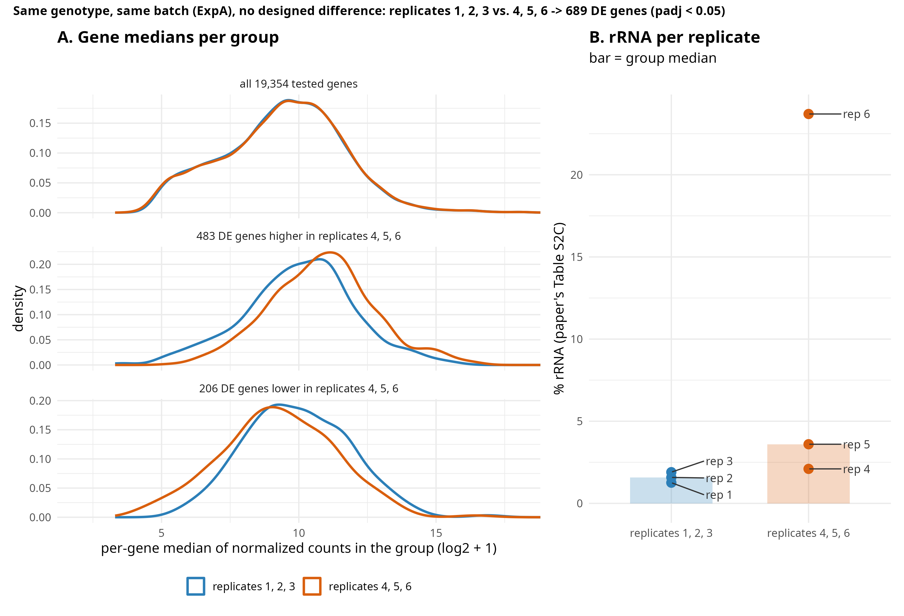

# Post 6: why does one same-batch 3-vs-3 split give 689 DE genes?

**Question.** In post 5, split 6 (replicates 1, 2, 3 vs. 4, 5, 6 of ExpA) gave more than 500 DE
genes under every normalization: 689 with DESeq2 median-of-ratios, 503-615 with total-count
scaling. Same genotype, same batch, no designed difference. Group 2 holds the three highest-rRNA
ExpA replicates. Is the rRNA responsible?

**Short answer.** No. The seven ExpA replicates carry a strong gradient of their own, which follows
the replicate numbering, not the rRNA fraction. Split 6 happens to cut across that gradient.

- Globally the two groups look the same: the distributions of per-gene medians overlap (panel A,
  top). The 689 DE genes are a shift in a specific subset (panel A, middle and bottom).
- rRNA differs between the groups mainly because of replicate 6 (panel B), but replicate 6 is not
  needed: replacing it with replicate 7 (1.87% rRNA) gives **1,389** DE genes instead of 689.
- Swapping replicate 3 for replicate 7 instead (1, 2, 7 vs. 4, 5, 6) collapses the result to
  **5** DE genes.

## What the analysis does (`split_structure.R`)
Run from the repository root; uses the ExpA coding-gene counts (`work/STAR_both/fC/`) and
`data/paper_TableS2C_rRNA.csv`. DESeq2 defaults (median-of-ratios, `~group`), DE = `padj < 0.05`.
The rRNA feature is not used: post 5 showed it does not change this split under median-of-ratios.
`THREADS` sets the number of cores for step 2.

1. **Split 6** (689 DE genes): 483 higher in replicates 4, 5, 6, 206 lower; 687 nuclear, 1
   chloroplast, 1 mitochondrial; modest effect sizes (median |log2FC| 0.71, max 2.62); well expressed
   (median baseMean 1,257 vs. 754 for all tested genes). List: `split6_DE_genes.csv`.
2. **All 70 distinct 3-vs-3 splits** of the 7 ExpA replicates: median 4 DE genes, 90th percentile
   229, maximum 1,600 (1, 2, 3 vs. 5, 6, 7). Split 6 ranks 5th. DE count vs. how well a split
   separates the groups' rRNA fractions: Spearman rho = -0.12. Table: `all_70_splits.csv`.
3. **PCA** of the 7 replicates (vst, 500 most variable genes): PC1 explains 64% of the variance and
   orders the replicates almost by number: 1 (-13.6), 2 (-12.2), 3 (-7.5), 4 (3.4), 5 (4.6),
   7 (11.4), 6 (13.8).
4. **Variants of split 6**: dropping any one replicate leaves 266-759 DE genes; 1, 2, 3 vs. 4, 5, 7
   gives 1,389; 1, 2, 7 vs. 4, 5, 6 gives 5.
5. **Per replicate**, mean signed log2 deviation from the group-1 mean on the 689 genes (positive =
   group-2 direction): 1 -0.10, 2 -0.04, 3 0.14, 4 0.64, 5 0.76, 6 0.99, **7 0.98**. Replicate 7
   (1.87% rRNA) behaves like replicate 6 (23.7%).

**The figure.** Panel A: for each gene, the median of the normalized counts in replicates 1, 2, 3
and in replicates 4, 5, 6, shown as distributions for all tested genes and for the DE genes split
by direction. Panel B: rRNA % per replicate from the paper's Table S2C, bar = group median.

## Interpretation
- The DE signal of split 6 comes from structure shared by the replicates, a gradient along
  1 -> 2 -> 3 -> 4 -> 5 -> 7/6. A 3-vs-3 split that puts the two ends of it in different groups gives
  hundreds to 1,600 DE genes; a split that mixes them gives almost none.
- rRNA is confounded with this split (group 2 has the higher rRNA), but it does not explain it:
  the strongest splits do not need replicate 6, replicate 7 follows the gradient with low rRNA,
  and across all 70 splits the DE count does not track rRNA separation.
- What the gradient is remains open. Among the top genes are ATHB-2/HAT4 (AT4G16780), HAT1
  (AT4G17460) and ATHB4 (AT2G44910), HD-ZIP II genes known to respond to light quality, shade and
  time of day. That suggests, **but does not show**, a difference in harvest time, plate position
  or light environment that follows the replicate numbering. The paper (section 2.1) gives the
  growth conditions but not harvest order or timing.

## What this means for QC
- "Same genotype, same batch" does not mean "no structure". Replicates can differ systematically
  for reasons nobody recorded, and an unlucky grouping turns that into hundreds of DE genes.
- A robust normalization (post 5) does not protect against this; it is not a normalization problem.
- Look at a PCA of the replicates and at per-sample metadata (harvest order, plate, extraction and
  library batch) before trusting a DE list, and randomize group assignment against them.
- A confounder that is visible (rRNA) is not necessarily the cause; check whether the effect
  survives without the sample that carries it.

## Limits
- One experiment (ExpA, 7 replicates), DESeq2 defaults, one threshold (`padj < 0.05`).
- Gene counts were made unstranded (`featureCounts` default `-s 0`) although the libraries are
  stranded (paper section 2.1); post 11 tests `-s 0/1/2` and reruns this post on stranded counts.
- The light/harvest-time reading is a hypothesis from a few known genes, not a tested result; it
  needs a GO enrichment of the 689 genes and the sample metadata (ArrayExpress E-MTAB-5446 SDRF,
  or the authors).
- Replicate numbering is the paper's (`data/replicate_map.tsv`); whether it reflects processing
  order is not documented.

**Next post:** significance vs. effect size: how many genes do `padj < 0.05`, `|log2FC| > 1 / > 2`
and their combinations call when there is no designed difference? (post 7)
