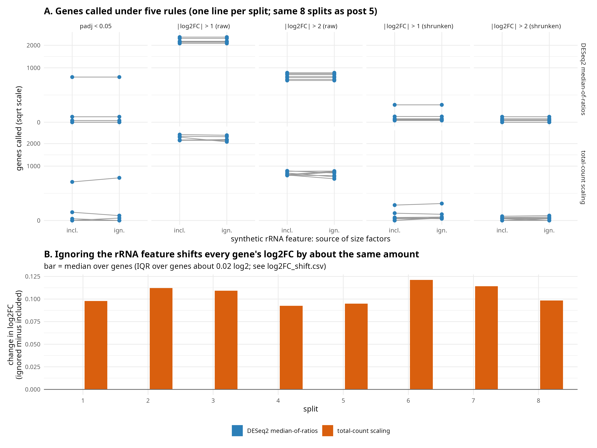

# Post 7: does normalization only move genes across padj < 0.05, or also shift effect sizes?

**Question.** Post 5 counted a gene as DE when `padj < 0.05`. Many analyses call DE on effect size
instead, e.g. `|log2FC| > 1` (2-fold) or `|log2FC| > 2` (4-fold). Does the picture from post 5
change when the call is based on effect size?

**Short answer.** Yes, in two ways.

- **Normalization shifts effect sizes, not only p-values.** With total-count scaling, ignoring the
  synthetic rRNA feature moves every gene's log2FC by about the same amount, roughly 0.1 log2 in
  every split (panel B). With DESeq2 median-of-ratios the shift is zero.
- **A raw fold-change cutoff alone is mostly noise.** In the same no-designed-difference splits,
  2,093-2,494 genes pass `|log2FC| > 1` and 587-832 pass `|log2FC| > 2`, including splits with 0
  genes at `padj < 0.05`. These are almost all genes with a handful of reads (median baseMean
  below 1), where 0 vs. 2 reads is a "4-fold change". Because the whole log2FC distribution moves,
  these counts change with total-count scaling in all 8 splits (e.g. 2,345 -> 2,093 genes).
- Calls that account for uncertainty are much smaller and as stable as `padj`: shrunken log2FC
  (apeglm) `> 1`: 0-102 genes; `padj < 0.05 & |log2FC| > 1`: 0-140; a formal test of
  `|log2FC| > 1` (DESeq2 `lfcThreshold = 1`): 0-3. Split 6 (post 6) stands out under every rule
  that accounts for uncertainty.

## What the analysis does (`effect_size.R`)
Run from the repository root; needs DESeq2 and apeglm; takes about 15 minutes (apeglm).
Same coding-gene counts, synthetic rRNA feature, 8 splits (`set.seed(1)`) and 4 size-factor
treatments as post 5: median-of-ratios or total-count scaling, with the synthetic rRNA feature
included or ignored for size factors; DE is always tested on the coding-only matrix. Each fit is
then scored under seven rules:

| Rule | What it uses |
|---|---|
| `padj < 0.05` | post 5's rule (Wald test, H0: log2FC = 0) |
| `\|log2FC\| > 1`, `\|log2FC\| > 2` (raw) | maximum-likelihood log2FC, no uncertainty |
| `\|log2FC\| > 1`, `\|log2FC\| > 2` (shrunken) | apeglm-shrunken log2FC (`lfcShrink`), pulls noisy estimates towards 0 |
| `padj < 0.05 & \|log2FC\| > 1` | significance plus a post-hoc effect-size filter |
| test `\|log2FC\| > 1`, `padj < 0.05` | `results(lfcThreshold = 1)`, H0: \|log2FC\| <= 1 |

Outputs: `effect_size_results.csv` (genes called per split, treatment and rule),
`log2FC_shift.csv` (per split and normalization: median and IQR over genes of the change in log2FC
when the rRNA feature is ignored, and the shift expected from the size factors alone, i.e. the
change in the between-group difference of mean log2 size factors), `raw_log2FC_expression.csv`
(how well expressed the genes passing a raw cutoff are).

**The figure.** Panel A: genes called under five rules, one line per split, for both
normalizations (rows). Panel B: for total-count scaling, the change in log2FC when the rRNA feature
is ignored, per split (bar = median over genes, dot = shift expected from the size factors).

## Results
**Splits (of 8) whose count changes when the synthetic rRNA feature is ignored:**

| Rule | median-of-ratios | total-count scaling |
|---|---|---|
| `padj < 0.05` | 0 | 4 |
| `\|log2FC\| > 1` (raw) | 1* | 8 |
| `\|log2FC\| > 2` (raw) | 0 | 8 |
| `\|log2FC\| > 1` (shrunken) | 0 | 7 |
| `\|log2FC\| > 2` (shrunken) | 0 | 4 |
| `padj < 0.05 & \|log2FC\| > 1` | 0 | 4 |
| test `\|log2FC\| > 1` | 0 | 1 |

\* by one gene (2,214 vs. 2,215): adding one row changes the median-of-ratios size factors by about
1e-6, enough to move a gene that sits exactly at the cutoff.

**Range of genes called** (min-max over the 8 splits and both rRNA treatments):

| Rule | median-of-ratios | total-count scaling |
|---|---|---|
| `padj < 0.05` | 0-689 | 0-615 |
| `\|log2FC\| > 1` (raw) | 2,098-2,448 | 2,093-2,494 |
| `\|log2FC\| > 2` (raw) | 589-826 | 587-832 |
| `\|log2FC\| > 1` (shrunken) | 1-102 | 0-97 |
| `\|log2FC\| > 2` (shrunken) | 0-10 | 0-8 |
| `padj < 0.05 & \|log2FC\| > 1` | 0-140 | 0-135 |
| test `\|log2FC\| > 1` | 0-3 | 0-3 |

**Log2FC shift when the rRNA feature is ignored** (total-count scaling): median over genes
0.09-0.12 log2 per split, IQR over genes about 0.02; expected from the size factors alone
0.11-0.14 (the fitted shift is slightly smaller because dispersions are re-estimated).
Median-of-ratios: 0 (IQR about 1e-6).

**Genes passing a raw cutoff** (median-of-ratios, all 8 splits): median baseMean 0.7-0.9 reads
(all genes: about 410); 88-97% of the `|log2FC| > 1` genes and 96-100% of the `|log2FC| > 2`
genes have baseMean below 10.

## Why it happens
- Size factors enter every gene's log2FC as the same offset: log2FC is estimated from normalized
  counts, so changing the ratio of size factors between the groups adds roughly the same constant
  to every gene. Total-count scaling of a sample with 23.7% rRNA (replicate 6, always in group 2)
  changes that ratio; median-of-ratios barely sees one extra row (post 5).
- A fixed `|log2FC|` cutoff is therefore directly exposed to normalization: a constant shift of
  0.1 log2 moves every gene that sits near the cutoff. `padj` is less exposed because it also
  weighs the dispersion; most genes near the fold-change cutoff are nowhere near significance.
- Raw log2FC estimates from genes with almost no reads are extreme by construction (0 vs. 2 reads
  is a 4-fold change). They dominate any raw fold-change cutoff, which is why thousands of genes
  pass in comparisons with no designed difference. Shrinkage (apeglm) and the `lfcThreshold` test
  account for that uncertainty; a post-hoc filter on top of `padj` also removes them.

## What this means for QC
- "Fold change > 2" without a measure of uncertainty is not a DE call. In 3-vs-3 designs it is
  dominated by genes with a few reads.
- Normalization choice changes effect sizes, not only p-values. Report which normalization was
  used next to any fold-change threshold, and prefer one that is robust to dominant features.
- Use shrunken log2FC for ranking and effect-size filtering, and `lfcThreshold` when the question
  is "changed by more than X-fold", rather than filtering raw estimates after the fact.
- The split-6 signal (post 6) survives every rule that accounts for uncertainty: it is real
  sample structure, not a normalization or threshold artefact.

## Limits
- Same synthetic rRNA feature and the same 8 sampled splits as post 5 (not all 60 rep-6 splits);
  see posts 4-5 for the two-component model and its assumptions.
- One shrinkage method (apeglm; ashr and normal not compared), one significance level. apeglm
  reports optimizer warnings ("line search routine failed") for a few dozen genes across the 32
  fits; they do not change the counts above.
- The log2FC shift is not exactly constant over genes (IQR about 0.02 log2) because dispersions
  are re-estimated with the new size factors.
- Gene counts were made unstranded (`featureCounts` default `-s 0`) although the libraries are
  stranded (paper section 2.1); post 8 tests `-s 0/1/2` and reruns this post on stranded counts.
